# Avances - TP Integrador DOO 2026

**Materia:** Diseño Orientado a Objetos  
**Carrera:** Ingeniería en Sistemas - UBP  
**Proyecto:** Aguas Vital SA  
**Fecha:** 15/06/2026

---

## Segunda Entrega

### Actividad 1: Esqueleto del Proyecto Maven ✅

```
tp-doo-aguas-vital-2026/
├── pom.xml
└── src/main/
    ├── java/org/ubp/edu/doo/tpdooaguasvital2026/
    │   ├── App.java
    │   ├── controladores/
    │   │   ├── Controller.java              → Clase base (progress, cerrarVentana, showAlert)
    │   │   ├── PrincipalController.java      → Menú principal (Registrar / Consultar / Salir)
    │   │   ├── PedidosController.java        → Listado, búsqueda, CRUD de pedidos
    │   │   └── EditarPedidoController.java   → UC-4 (nuevo) y UC-8 (modificar) con validador
    │   ├── dao/
    │   │   ├── ConexionSql.java
    │   │   ├── Dao.java
    │   │   ├── ClienteDao.java
    │   │   ├── DistribuidorDao.java
    │   │   ├── PedidoDao.java
    │   │   ├── ProductoDao.java
    │   │   └── ZonaDao.java
    │   ├── dto/ (7 clases)
    │   ├── factories/ (FabricaDao, FabricaModelo)
    │   ├── modelo/ (18 clases + Modelo + Estado)
    │   └── util/
    │       └── InicializadorBD.java          → Ejecuta esquema SQL al iniciar
    └── resources/org/ubp/edu/doo/tpdooaguasvital2026/
        ├── principal.fxml                    → Menú principal
        ├── pedidos.fxml                      → Listado de pedidos con búsqueda
        ├── editarPedido.fxml                 → Formulario UC-4 / UC-8
        └── esquema-aguas-vital.sql           → DDL + datos de prueba
```

**Compilación:** `mvn compile` → BUILD SUCCESS (42 archivos)  
**Ejecución:** `mvn javafx:run` → App JavaFX inicia correctamente

---

### Actividad 2: DAOs + SQLite + Esquema de BD ✅

- [x] Esquema SQLite con 16 tablas + datos de prueba
- [x] `ConexionSql.java` — SQLite con ruta relativa (writable)
- [x] 4 DAOs de consulta (`Cliente`, `Producto`, `Distribuidor`, `Zona`)
- [x] `PedidoDao.java` — CRUD transaccional completo
- [x] Pruebas DAO exitosas (cliente, producto, zona, distribuidor, pedido, insert)

---

### Actividad 3: FXML + Controladores ✅

- [x] `principal.fxml` + `PrincipalController` — Menú con opciones Registrar/Consultar/Salir
- [x] `pedidos.fxml` + `PedidosController` — Listado, búsqueda por nro, Nuevo/Modificar/Eliminar
- [x] `editarPedido.fxml` + `EditarPedidoController` — Formulario único para UC-4 y UC-8:
  - `guardar()` → DAO insertar (UC-4: Registrar pedido)
  - `modificar()` → DAO modificar (UC-8: Actualizar pedido)
  - Validación de campos con ValidatorFX
  - Agregar/quitar items del detalle
  - ComboBox de cliente y producto con datos de BD

---

### Actividad 4: Diagrama StarUML con Patrones ✅

**Diagrama "Patrones de Diseno":** 48 vistas totales (25 class views + 23 edge views)
**UBICACIÓN:** Las clases se organizan en 4 zonas horizontales agrupadas por capa arquitectónica:

| Zona | Patrones | Clases | Ubicación X |
|------|----------|--------|-------------|
| Capa de Acceso a Datos | DAO + Factory Method | Dao, FabricaDao, FabricaModelo + 5 DAOs | x=40 |
| Capa de Negocio | MVC (Modelo) | Modelo, Cliente, Pedido, Producto | x=320 |
| Comportamiento: State | State | PedidoEstado + 6 estados concretos | x=600 |
| Comportamiento: Strategy+Observer | Strategy + Observer | EstrategiaPrecio + 2 estrategias, Observador + 2 notificaciones | x=880 |

- [x] **DAO** — `Dao <<interface>>` + 5 implementaciones (`ClienteDao`, `ProductoDao`, `PedidoDao`, `ZonaDao`, `DistribuidorDao`)
- [x] **Factory Method** — `FabricaDao.fabricar()` y `FabricaModelo.fabricar()`
- [x] **MVC** — `Modelo <<abstract>>` heredado por `Pedido`, `Cliente`, `Producto`
- [x] **State** — `PedidoEstado <<interface>>` + 6 estados concretos
- [x] **Strategy** — `EstrategiaPrecio <<interface>>` + `EstrategiaMayorista`, `EstrategiaMinorista`
- [x] **Observer** — `Observador <<interface>>` + `NotificacionEmail`, `NotificacionSMS`

#### Justificación de cada patrón contra el material de la materia

| Patrón | Fuente | Diagrama UML en el PDF | Cómo se aplicó en el TP |
|--------|--------|------------------------|-------------------------|
| **DAO** | Clase 8, págs. 16-18 | `Dao<T>` con CRUD genérico (insertar, modificar, buscar, buscarTodos, borrar); implementaciones por entidad | `Dao` interfaz genérica con 5 `UMLInterfaceRealization` hacia ClienteDao, ProductoDao, PedidoDao, ZonaDao, DistribuidorDao |
| **Factory Method** | Clase 12, págs. 16-18 | Creator con FactoryMethod() que retorna Product; ConcreteCreator sobreescribe | `FabricaDao.fabricar(String tipo)` retorna el DAO según parámetro. Variante parametrizada (pág. 18: "permite parametrizar la factoría") |
| **MVC** | Clase 9, págs. 7-13 | Modelo con lógica de negocio, Vista con UI, Controlador como intermediario | `Modelo` clase abstracta base, 3 Controllers + 3 FXMLs en Java. En UML se modela la jerarquía de Modelo |
| **State** | Clase 14, págs. 4-5 | Context delega al Estado concreto; cada estado define transiciones | `Pedido` (Context) asocia 1..1 a `PedidoEstado`. 6 concretos implementan `siguienteEstado()` y `cancelar()` |
| **Strategy** | Clase 14, págs. 14-15 | Context con referencia a Estrategia; algoritmos intercambiables | `Producto` (Context) asocia 1..1 a `EstrategiaPrecio`. `calcularPrecio()` varía según Mayorista/Minorista |
| **Observer** | Clase 14, págs. 24-25 | Subject notifica a Observadores; desacopla emisor de receptores | `Pedido` (Subject) asocia 1..* a `Observador`. NotificacionEmail y SMS implementan `notificarCambioEstado()` |

**Relaciones UML modeladas:**
- 13 UMLGeneralizationView (State 6 + Strategy 2 + Observer 2 + MVC 3)
- 5 UMLInterfaceRealizationView (DAO: 5 DAOs → Dao)
- 3 UMLAssociationView (Pedido→PedidoEstado, Producto→EstrategiaPrecio, Pedido→Observador)
- 2 UMLDependencyView (FabricaDao→Dao, FabricaModelo→Modelo)

---

## Decisiones de Diseño

| Decisión | Opción | Justificación |
|----------|--------|---------------|
| BD | SQLite | Mismo que el ejemplo de la cátedra |
| ORM | ModelMapper | Conversión DTO↔Modelo automática |
| Package | `org.ubp.edu.doo.tpdooaguasvital2026` | Convención del ejemplo |
| DTOs | Capa separada | Desacoplar BD de UI |
| UI | JavaFX 13 + FXML | Requerimiento de la entrega |
| Alcance | UC-4 + UC-8 | Definido en el TP |
| App | Inicialización BD en `static{}` | BD lista antes de mostrar UI |

---

## Resumen de Archivos

| Capa | Archivos | Estado |
|------|----------|--------|
| Modelo | 18 clases + Modelo + Estado | ✅ |
| DTO | 7 clases | ✅ |
| DAO | 1 interfaz + 5 impls + ConexionSql | ✅ |
| Factories | FabricaDao, FabricaModelo | ✅ |
| Util | InicializadorBD | ✅ |
| Controladores | Controller + 3 controladores | ✅ |
| FXML | 3 pantallas | ✅ |
| BD | Esquema SQL con datos de prueba | ✅ |
| StarUML | `algo corregido.mdj` (614KB, 2 diagramas, 82 vistas) | ✅ |

**Total: 42 archivos Java + 3 FXML + 1 SQL + 1 mdj → BUILD SUCCESS**  
**Testeo: 38/38 pruebas pasadas**

---

### Mermaid: Vista general de los patrones agrupados por capa

```mermaid
classDiagram
    %% ===== CAPA DE ACCESO A DATOS (DAO + Factory Method) =====
    class Dao {
        <<interface>>
        +insertar(T) T
        +modificar(T) T
        +buscar(Object) T
        +buscarTodos() List~T~
        +borrar(Object) void
    }
    class ClienteDao
    class ProductoDao
    class PedidoDao
    class ZonaDao
    class DistribuidorDao
    class FabricaDao {
        +fabricar(String) Dao
    }
    ClienteDao ..|> Dao
    ProductoDao ..|> Dao
    PedidoDao ..|> Dao
    ZonaDao ..|> Dao
    DistribuidorDao ..|> Dao
    FabricaDao ..> Dao : <<create>>

    %% ===== CAPA DE NEGOCIO (MVC - Modelo) =====
    class Modelo {
        <<abstract>>
    }
    class Cliente
    class Pedido {
        -estadoActual: PedidoEstado
        -observadores: List~Observador~
    }
    class Producto {
        -estrategiaPrecio: EstrategiaPrecio
    }
    Cliente --|> Modelo
    Pedido --|> Modelo
    Producto --|> Modelo

    %% ===== STATE =====
    class PedidoEstado {
        <<interface>>
        +siguienteEstado(Pedido)
        +cancelar(Pedido)
    }
    class PedidoPendiente
    class PedidoConfirmado
    class PedidoEnPreparacion
    class PedidoEnReparto
    class PedidoEntregado
    class PedidoCancelado
    PedidoPendiente ..|> PedidoEstado
    PedidoConfirmado ..|> PedidoEstado
    PedidoEnPreparacion ..|> PedidoEstado
    PedidoEnReparto ..|> PedidoEstado
    PedidoEntregado ..|> PedidoEstado
    PedidoCancelado ..|> PedidoEstado
    Pedido "1" --> "1" PedidoEstado

    %% ===== STRATEGY =====
    class EstrategiaPrecio {
        <<interface>>
        +calcularPrecio(double) double
    }
    class EstrategiaMayorista
    class EstrategiaMinorista
    EstrategiaMayorista ..|> EstrategiaPrecio
    EstrategiaMinorista ..|> EstrategiaPrecio
    Producto "1" --> "1" EstrategiaPrecio

    %% ===== OBSERVER =====
    class Observador {
        <<interface>>
        +notificarCambioEstado(Pedido)
    }
    class NotificacionEmail
    class NotificacionSMS
    NotificacionEmail ..|> Observador
    NotificacionSMS ..|> Observador
    Pedido "1" --> "*" Observador
```


